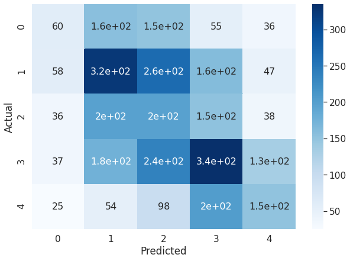
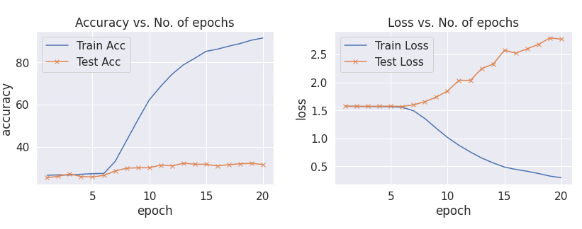
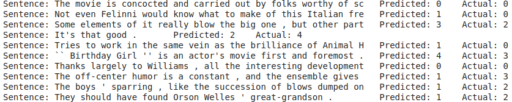

# E2A7_1

## Changes Made  
- Migrated code to PyTorchLightning
- Used Torchmetrics library for Accuracy
- Got rid of the BucketIterator which is part of legacy code. Built a Dataset with padding done before passing to model

## Loading Data

As required by the instructions, only the .txt files in the zip have been used (unlike previously where the `pytreebank` module was used).

## Explanation of Files

**`sentiment_labels.txt`:** This file contains the mapping of phrase ids (not the phrases) to the sentiments. The `pd.cut` method was used to categorize them into 5 discrete classes. The 'sentiments' are henceforth referred as 'labels'

**`datasetSentences.txt`:** This file contains the sentences without any sentiments

**`dictionary.txt`:** This file contains the mapping of phrases to their sentiments. After this file is loaded, the phrases are mapped to the sentences, followed by mapping to the (discrete) labels.

**`datasetSplit.txt`:** This file contains the splitting of the dataset into train/test/dev set. Since we are only required to have a train/test split, this file is NOT used

Using regular expressions, the sentences are 'cleaned'. Only these cleaned sentences and their labels are retained and other columns are dropped

The final dataset has 11286 samples.

## Data Split
The data is split into train/test  sets using a 70/30 ratio.

## Model
Almost the same model as presented in the orginal notebooks was used. 

## Results

I was able to get >>60% on the train dataset. Despite tinkering with the hyperparameters, I wasn't able to get accuracy > 40% in the validation dataset.

#### Training Log
|    epoch    |   Train Acc |  Train Loss |   Valid Acc |  Valid Loss |
| ----------- | ----------- | ----------- | ----------- | ----------- | 
|           1 |      26.481 |      1.5738 |      25.307 |      1.5768 |
|           2 |       26.62 |      1.5705 |      26.019 |      1.5752 |
|           3 |       26.57 |        1.57 |      27.082 |      1.5743 |
|           4 |      26.962 |      1.5692 |      25.842 |      1.5763 |
|           5 |      27.215 |      1.5663 |      25.694 |      1.5767 |
|           6 |      27.316 |      1.5574 |      26.403 |      1.5716 |
|           7 |      33.063 |      1.4942 |      28.529 |      1.5997 |
|           8 |      42.949 |      1.3551 |      29.829 |      1.6569 |
|           9 |      52.823 |      1.1813 |      30.006 |      1.7388 |
|          10 |      62.241 |      1.0161 |      30.035 |      1.8491 |
|          11 |      68.633 |     0.87763 |      31.276 |      2.0389 |
|          12 |      74.405 |     0.75788 |      30.951 |      2.0378 |
|          13 |      78.848 |     0.65064 |      32.162 |      2.2488 |
|          14 |      81.962 |      0.5633 |      31.719 |      2.3266 |
|          15 |      85.266 |      0.4895 |       31.66 |      2.5752 |
|          16 |      86.304 |     0.44724 |      30.892 |      2.5232 |
|          17 |      87.722 |     0.41379 |      31.512 |      2.6002 |
|          18 |      88.975 |     0.37405 |      31.896 |      2.6794 |
|          19 |       90.57 |     0.32838 |      32.132 |       2.794 |
|          20 |      91.608 |     0.29901 |      31.571 |      2.7736 |

#### Confusion Matrix

#### Loss/Accuracy vs Epochs

## Sample outcomes

